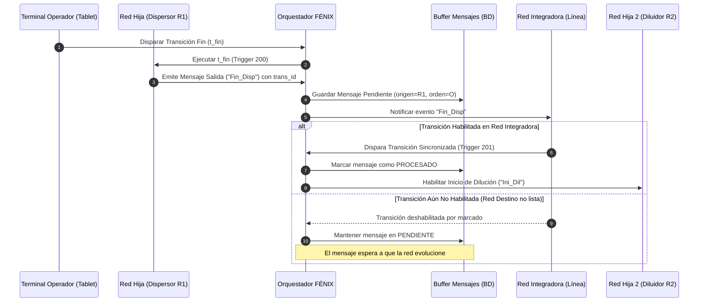
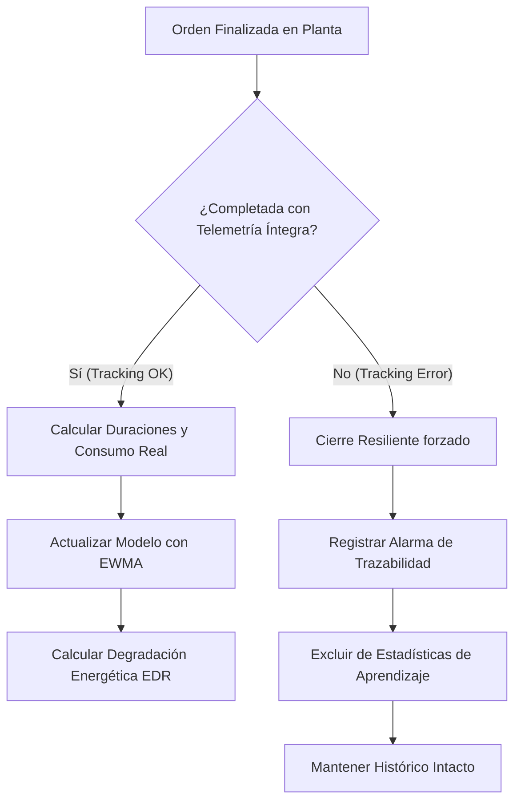

# Manual Técnico de Arquitectura, Integración y Modelado Matemático MOM (FÉNIX)

---

## 0. Filosofía y Génesis del Sistema FÉNIX

El sistema **FÉNIX** (Manufacturing Operations Management - MOM) representa un cambio de paradigma en la automatización y control de operaciones industriales. Nace de la evolución histórica desde los modelos rígidos de control jerárquico vertical (como los esquemas clásicos **ISA-95** implementados históricamente en grandes sectores como la industria petroquímica) hacia un **enfoque holónico, distribuido y orientado a actividades**.

```
          ENFOQUE CLÁSICO (ISA-95)                      ENFOQUE HOLÓNICO (FÉNIX)
                 
               [ Nivel 4: ERP ]                                    ┌──────────────┐
                      │                                    ┌──────>│ Holón Orden  │<──────┐
               [ Nivel 3: MES ]                            │       └──────────────┘       │
                      │                                    ▼                              ▼
              [ Nivel 2: SCADA ]                   ┌──────────────┐              ┌──────────────┐
                      │                            │ Holón Recurso│<────────────>│ Holón Producto│
              [ Nivel 1: PLCs ]                    └──────────────┘              └──────────────┘
                                                    (Autonomía Edge)              (Conocimiento)
```

### 0.1. El Paradigma de la Unidad Holónica de Producción (HPU)
En FÉNIX, la fábrica se modela mediante una red de **Holones** cooperativos (inspirados en PROSA y ADACOR):
* **Holón Recurso (RH):** Representa la entidad física (máquina, línea, operario) junto con su Gemelo Digital, encapsulando su capacidad, tarifas de costo horario, rendimientos ($\gamma$), agenda temporal y su **matriz de conectividad física ($\mathcal{K}$)**.
* **Holón Producto (PH):** Encapsula el conocimiento de fabricación (recetas BOM, especificaciones de calidad, tolerancias fisicoquímicas e invariantes de proceso).
* **Holón Orden (OH):** Representa la instancia de demanda en el tiempo ($d = \text{deadline}$, cantidad objetivo $V_{\text{target}}$), encargada de negociar con los recursos para garantizar el cumplimiento de la entrega al mínimo costo.

---

## 1. Fundamento Matemático: Redes de Petri AB-TPPN

El núcleo de orquestación y costeo en FÉNIX se formaliza mediante una **Red de Petri Temporizada con Lugares con Costo por Actividad (AB-TPPN - Activity-Based Timed Place Petri Net)**.

### 1.1. Tupla de Definición Formal
Una red de proceso se define como una tupla:
$$\mathcal{N} = \langle P, T, F, W, \Omega, C_p, \mathcal{T} \rangle$$

Donde:
* $P = \{p_1, p_2, \dots, p_n\}$: Conjunto finito de **lugares** (representan estados de ocupación de recursos, buffers o etapas de procesamiento).
* $T = \{t_1, t_2, \dots, t_m\}$: Conjunto finito de **transiciones** (eventos discretos de inicio/fin de paso, validación de compuertas o trasvases).
* $F \subseteq (P \times T) \cup (T \times P)$: Arcos dirigidos de flujo de proceso.
* $W: F \to \mathbb{N}^+$: Matriz de pesos de los arcos.
* $\Omega: P \to \mathbb{R}^+$: Vector de **duraciones nominales** en lugares ($\tau_i$).
* $C_p: P \to \mathbb{R}^4$: Vector de **tasas de costeo ABC** asociadas al lugar:
  $$C_p(p_i) = \langle \kappa_i, \omega_i, \delta_i, \sigma_i \rangle$$
  * $\kappa_i$: Tasa horaria de energía eléctrica (\$/h).
  * $\omega_i$: Tasa horaria de mano de obra directa (\$/h).
  * $\delta_i$: Tasa horaria de amortización / depreciación de equipo (\$/h).
  * $\sigma_i$: Consumo específico de insumos auxiliares (\$/h).
* $\mathcal{T}$: Conjunto de tipos de disparo / triggers asociados a las transiciones:
  * **Trigger 200**: Evento externo manual (operador vía terminal/tablet).
  * **Trigger 201**: Evento sincronizado inter-redes (mensaje / transferencia de material).
  * **Trigger None / Auto**: Disparo automático tras cumplirse la temporización del lugar.

### 1.2. El Token Coloreado y la Trazabilidad Dinámica
El estado de la producción se modela mediante el avance de un **Token Coloreado** $\mathbf{\theta}$, definido por la 4-tupla dinámica:
$$\mathbf{\theta}(t) = \langle o, m(t), c(t), \tau_{\text{stamp}}(t) \rangle$$

* $o$: Identificador unívoco de la orden de producción.
* $m(t)$: Masa / volumen actual de producto en el lote, ajustado retroactivamente por los factores de merma de cada estación:
  $$m_{k} = m_{k-1} \cdot \gamma_k, \quad \text{donde } \gamma_k \in (0, 1]$$
* $c(t)$: Costo acumulado por el lote hasta el tiempo $t$:
  $$c(t) = c_{\text{MP}} + \sum_{k \in \text{Ruta}} \Delta c_k$$
  $$\Delta c_k = (\kappa_k + \omega_k + \delta_k + \sigma_k) \cdot \Delta t_k$$
* $\tau_{\text{stamp}}(t)$: Vector de marcas de tiempo de entrada/salida para el cálculo de KPIs y variaciones temporales.

---

## 2. Arquitectura del Software e Integración IT/OT

FÉNIX opera en una arquitectura de tres niveles desacoplados, implementada en Python / Flask / SQLAlchemy con una base de datos relacional transaccional (SQLite / PostgreSQL).

```
┌─────────────────────────────────────────────────────────────────────────────┐
│                           CAPA DE GESTIÓN (IT / MES)                         │
│  • Planificador Holónico (Composición Selectiva, B&B, Ruteo en Grafo Físico) │
│  • Módulo de Cargas Validadas & Semáforo Pre-Producción                     │
│  • Lazo de Aprendizaje Continuo (EWMA de Tiempos y Degradación EDR)         │
└──────────────────────────────────────┬──────────────────────────────────────┘
                                       │ Mensajería / Handshake
┌──────────────────────────────────────▼──────────────────────────────────────┐
│                        CAPA DE ORQUESTACIÓN (SCADA / EDGE)                  │
│  • Motor AB-TPPN (motor_abtppn.py): Evolución de Marcados y Disparos        │
│  • Orquestador Holónico (orquestador.py): Coordinación de Redes e Invariantes │
│  • Buffer Asíncrono de Mensajes Inter-Redes (Evita pérdida por desalineación)│
│  • Mecanismo de Resiliencia ante Tracking Error (Exclusión de Lotes)        │
└──────────────────────────────────────┬──────────────────────────────────────┘
                                       │ Telemetría / Eventos
┌──────────────────────────────────────▼──────────────────────────────────────┐
│                           CAPA FÍSICA / OPERATIVA (OT)                       │
│  • PLCs, Sensores IoT (Temperatura, RPM, Consumo Eléctrico kWh)             │
│  • Terminal de Operador Web / Tablet (/operador)                            │
└─────────────────────────────────────────────────────────────────────────────┘
```

### 2.1. Ontología de Clases y Estructura de Base de Datos
* **Continuants (Entidades Estáticas / Saber Hacer):**
  * `Recurso`: Maquinaria y puestos de trabajo con capacidad, mermas y tarifas horarias.
  * `ConectividadRecurso`: Arcos dirigidos que definen qué máquina puede transferir material a cuál ($R_i \to R_j$).
  * `Producto` y `Material`: Receta de insumos (BOM) y costo unitario.
  * `PatronDeRuta` y `EtapaRuta`: Secuencia de servicios maestros requeridos ($s_1 \to s_2 \to \dots \to s_k$).
  * `InvariantePaso`: Restricciones operativas (ej. $\text{Temperatura} \le 55^\circ\text{C}$).
* **Perdurants (Entidades Dinámicas / El Hacer):**
  * `OrdenProduccion`: Demanda activa, cantidades requeridas y estado de ciclo de vida.
  * `InstanciaRed`: Gemelo digital en memoria/BD de la red de Petri activa (marcado actual, token acumulado).
  * `EventoRed`: Registro inmutable de cada disparo de transición para auditoría forense y calibración.
  * `MensajeInterRed`: Buffer de coordinación y transferencia de lote entre etapas.

---

## 3. Protocolos de Orquestación y Sincronización

### 3.1. Sincronización Jerárquica e Inter-Redes (Handshake 201)
Cuando un proceso de manufactura requiere la interacción entre dos máquinas independientes (ej. Dispersor $R_1$ terminando y trasvasando a Diluidor $R_2$), el intercambio se coordina mediante el protocolo de **Mensajería Asíncrona Bufferizada**:



### 3.2. Validación de Invariantes y Compuertas de Calidad (QA Loops)
Antes de ejecutar el disparo de una transición de salida de estación:
1. **Validación de Invariantes Físicos:** El orquestador evalúa los valores de telemetría reportados ($T^\circ, \text{RPM}$):
   $$\text{Si } V_{\text{telemetria}} < \text{Limite}_{\min} \quad \text{o} \quad V_{\text{telemetria}} > \text{Limite}_{\max} \implies \text{Bloqueo de Transición y Alarma}$$
2. **Compuertas de Calidad (QA Gates):**
   * **Aprobado (Pasa):** Se dispara la transición normal (Trigger `201`), transfiriendo el token a la siguiente etapa.
   * **Rechazado (No Pasa / Reproceso):** Se dispara la transición de retrabajo (Trigger `200`), retornando el token al inicio del paso y acumulando costos adicionales de energía y operario.

---

## 4. Algoritmo de Planificación Holónica y Cotización

El módulo `PlanificadorProduccion` resuelve el problema de asignación y ruteo óptimo mediante **Composición Selectiva**:

```
      ORDEN: 1.000 L de Producto P  (Ruta: Dispersión -> Dilución -> Envasado)
                           │
      ┌────────────────────┴────────────────────┐
      ▼                                         ▼
Opción 1: DISP-A (Rend: 97%)             Opción 2: DISP-B (Rend: 94%)
      │                                         │
      ▼ (Grafo Físico K)                        ▼ (Grafo Físico K)
Tanque DIL-1 (Rend: 99%)                 Tanque DIL-2 (Rend: 98%)
      │                                         │
      ▼                                         ▼
Envasadora ENV-AUTO                      Envasadora ENV-AUTO
      │                                         │
Cálculo Retropropagado de Masa:          Cálculo Retropropagado de Masa:
M_req = 1000 / (0.97 * 0.99) = 1.041 kg   M_req = 1000 / (0.94 * 0.98) = 1.085 kg
Costo Total ABC: $1.346                  Costo Total ABC: $1.412
      │                                         │
      └─────────────────┬───────────────────────┘
                        ▼
           SELECCIÓN: Opción 1 (Menor Costo Global)
```

### 4.1. Formalización de la Absorción de Mermas
Para una orden de volumen objetivo $V_{\text{target}}$ y una ruta de $K$ recursos seleccionados $\langle R_1, R_2, \dots, R_K \rangle$ con rendimientos respectivos $\gamma_1, \gamma_2, \dots, \gamma_K$:
$$M_{\text{inicial requerido}} = \frac{V_{\text{target}}}{\prod_{k=1}^{K} \gamma_k}$$

### 4.2. Ruteo Físico en Grafo Dirigido
FÉNIX implementa una búsqueda de caminos válidos (BFS/DFS) sobre la matriz de adyacencia de planta:
$$\mathcal{K} = [k_{ij}], \quad k_{ij} = 1 \iff \text{Existe conexión física/tubería entre Recurso } i \text{ y Recurso } j$$
Si una combinación de máquinas no tiene continuidad física en $\mathcal{K}$, se poda del espacio de soluciones.

---

## 5. Resiliencia Operativa y Lazo de Aprendizaje Continuo

### 5.1. Manejo de Resiliencia ante *Tracking Error* (Pérdida de Eventos)
En entornos reales de planta, un operario puede omitir el registro de un evento intermedio o un sensor puede perder comunicación.
* **Diagnóstico:** La red de Petri queda bloqueada en un estado intermedio mientras la red integradora recibe el evento final de la orden.
* **Mecanismo de Cierre de Resiliencia (`forzar_cierre_por_error_seguimiento`):**
  1. El orquestador fuerza el cierre ordenado de la red hija.
  2. Registra el flag `error_seguimiento = True` en la `InstanciaRed`.
  3. **Aislamiento Estadístico:** En el lazo de aprendizaje, las órdenes marcadas con error de seguimiento son **estrictamente excluidas** de los cálculos estadísticos para evitar distorsionar los tiempos nominales y tarifas reales.



### 5.2. Calibración Continua con EWMA
Para los lotes ejecutados íntegramente, los parámetros estándar del modelo se calibran automáticamente mediante una Media Móvil Ponderada Exponencialmente (EWMA):
$$\hat{\tau}_{\text{nuevo}} = \alpha \cdot \tau_{\text{real}} + (1 - \alpha) \cdot \hat{\tau}_{\text{anterior}}, \quad \alpha \in [0.1, 0.3]$$

### 5.3. Razón de Degradación Energética ($EDR$)
FÉNIX monitorea el desgaste electromecánico de los equipos evaluando la razón entre el consumo real por unidad de tiempo y el estándar nominal:
$$EDR = \frac{\text{kWh}_{\text{reales}} / \Delta t_{\text{real}}}{\text{Tarifa}_{\kappa, \text{nominal}}}$$
* $EDR \approx 1.0$: Equipo operando en condiciones normales.
* $EDR > 1.15$: Alerta temprana de sobreconsumo / fricción mecánica (mantenimiento predictivo).

---

## 6. Módulo de Cargas Iniciales y Semáforo Pre-Producción

Para blindar la base de datos contra cargas corruptas o incompletas (*Garbage-In, Garbage-Out*), el `ValidadorIntegral` ejecuta 4 fases de validación determinística:

1. **Fase 1 - Integridad Referencial:** Valida existencia de insumos en BOM, servicios mapeados a máquinas y calendarios activos.
2. **Fase 2 - Conectividad Física de Planta:** Comprueba mediante análisis de alcanzabilidad que para cada producto exista al menos un camino continuo en $\mathcal{K}$.
3. **Fase 3 - Invariantes y Topología de Redes:** Chequea coherencia de rangos $[\text{mín}, \text{máx}]$ y propiedades de Workflow-Net (un solo $p_{\text{in}}$ y $p_{\text{out}}$).
4. **Fase 4 - Prueba en Seco (*Dry-Run* Virtual):** Simula la propagación de un token virtual a través de las redes de Petri de cada producto, validando acumuladores de costo y transiciones.

---

## 7. Mapeo de Componentes del Código Fuente

| Módulo / Archivo | Responsabilidad Arquitectónica |
| :--- | :--- |
| `fenix/utils/motor_abtppn.py` | Motor matemático de Redes de Petri: lugares temporizados, acumulador de tokens y disparos. |
| `fenix/servicios/orquestador.py` | Orquestación en tiempo real: buffer de sincronización 201, invariantes y resiliencia. |
| `fenix/servicios/planificador.py` | Planificación holónica: composición selectiva, absorción de mermas y cotización ABC. |
| `fenix/validadores/validador_integral.py` | Semáforo pre-producción anti-basura en 4 fases diagnósticas. |
| `web/routes/cargas_validadas.py` | Controlador web para la auditoría y visualización del semáforo. |
| `web/routes/planificador.py` | Controlador web del cotizador y optimizador de órdenes. |
| `web/routes/operador.py` | Terminal de operario para avance manual y captura SCADA. |
| `web/routes/aprendizaje.py` | Panel de auditoría de calibración EWMA y métricas EDR. |
