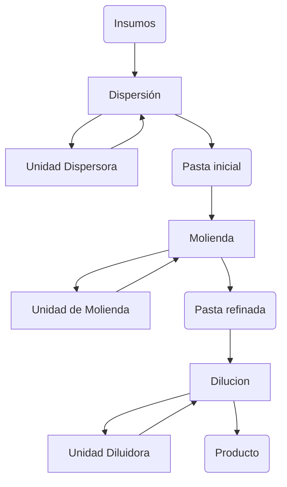
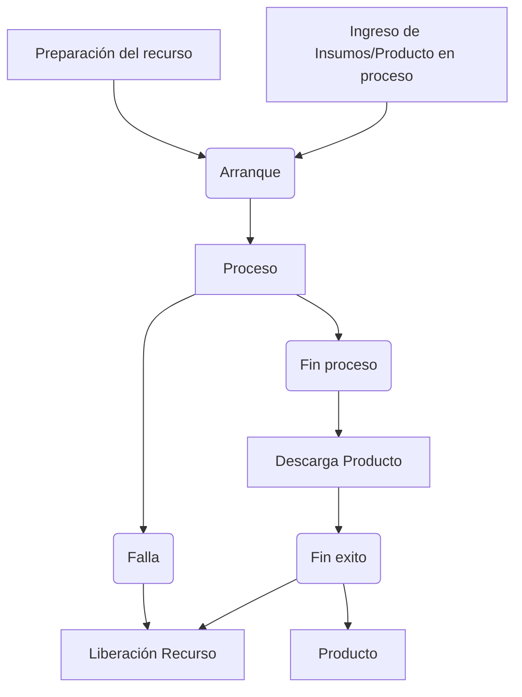

# Ejemplo de modelado.

Basado en el documento **Concept Ontologia Produccion**, se describe aquí el modelado de un producto de la familia DIS - MOL - DIL que hemos tomado como ejemplo.

Un producto de esta tiene las siguientes etapas:

- **Dispersión**. Es la primera *actividad* crítica en la mayoría de los **procesos de fabricación de pinturas**, donde los pigmentos (sólidos que dan color y opacidad) y otros aditivos en polvo se mezclan y se distribuyen uniformemente en un vehículo líquido (resina, solventes, agua). El objetivo es romper los aglomerados de partículas sólidas y humedecerlas completamente con el líquido, asegurando que cada partícula esté rodeada por la resina. Una buena dispersión es fundamental para el color, el brillo y la estabilidad de la pintura. Se realiza en unidades de dispersión.

- **Molienda**. Inmediatamente después o durante la dispersión, la molienda se encarga de reducir el tamaño de las partículas de los pigmentos y distribuirlos de manera aún más fina y homogénea en la mezcla. Se realiza en Molinos.

- **Dilución**. Una vez que los pigmentos han sido dispersados y molidos a la finura deseada, la pasta concentrada resultante se diluye. En esta **actividad** final se añaden los componentes restantes de la fórmula de la pintura, como el resto de la resina, solventes adicionales. La Unidad de Dilución es la responsable de esta actividad.

## Modelo del producto

El modelo del producto contiene dos partes
- La descripción del producto, con sus características que definen sus atributos de calidad. Tamaño, color, densidad, etc. insumos necesarios, son descritos en un archivo en excel o un archivo yaml.
- La descripción del  proceso general. Un producto se obtiene mediante la utilización de recursos que tienen la capacidad de realizar unos procesos necesarios para la obtención del producto. Esos procesos los llamaremos servicios de manufactura. Esos servicios son utilizados para cumplir con un objetivo de producción (orden de producción). La orden de producción contiene el producto, la cantidad necesaria, los recursos a utilizar y el encadenamiento de los procesos (secuencia de servicios) y "hand-shake" de acuerdo a los recursos que fueron seleccionados.

El flujo total para obtener el producto se ve en el esquema a continuación con sus tres elementos Procesos (Dispersión, Molienda, Dilución), los recursos (Unidad dispersora, Molinos y Unidad Diluidora) y el producto en sus cuatro estados (Insumos, Pasta, Pasta refinada, Producto)

El paso del producto de una unidad a otra implica un intercambio de materia entre las unidades, que no es visto en la descripción anterior, y que va a depender de la tecnología disponible para hacer la carga de insumos y el trasvase del producto, lo que nos va a dar un esquema de implantación para cada configuración que se pueda tener para una familia o grupo de productos.

## Modelo de Proceso

El proceso asociado a una etapa del modelo del producto tiene varias condiciones necesarias para su ejecución:
- La preparación del recurso
- El traslado de lo insumos y/o del producto en proceso
- La ejecución del proceso propiamente dicho
- La entrega del producto
- La liberación del recurso

La dinámica asociada se da a continuación:

## Modelos de Procesos para productos de la familia DIS-MOL-DIL

### Proceso de Dispersión
El proceso de Dispersión se realiza en de distintas maneras según el tipo de producto.

- Fase de carga.
 1. Carga del vehículo
 2. Carga de polvos en algunos casos
 3. Carga de Sólidos.
- Fase inicial de dispersión.
- Fase de molienda dentro del proceso de dispersión. Molino especial.  
- Fase de ajustes. 
- Fase de ajustes finales.
- Descarga a molinos
  
 La fase de ajustes y la de ajustes finales dependen del tipo de producto y del resultado de los pasos anteriores.

El resultado del proceso puede fallar y el producto se descarta.

