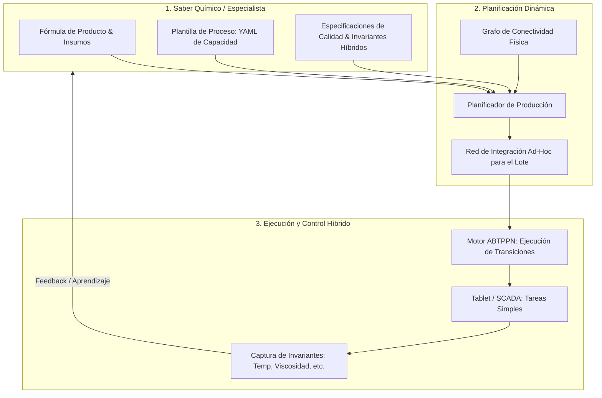

# Plan de Refactorización: FÉNIX — MES Holónico Basado en Recetas

Este documento resume la base conceptual y el plan de trabajo por sesiones para refactorizar el sistema **FÉNIX**, transitando de un modelo centrado puramente en la ejecución física del operador hacia un modelo centrado en la **Receta del Diseñador** y la **Composición Dinámica de Procesos** (Sistemas Híbridos).

---

## 1. Visión Conceptual Refinada

El sistema se estructura en tres capas conceptuales claras para evitar que los operarios y químicos tengan que lidiar con la complejidad matemática subyacente:

---

## 2. Diagnóstico del Estado Actual del Código

* **Lo que está bien estructurado:**
  * Separación de taxonomía (Taxonomia.py) y asignaciones reales (Producto.py).
  * Motor de Petri tolerante a fallos y basado en triggers (motor_abtppn.py).
  * Captura de logs e historial de eventos con un campo para `invariantes` (ProcesoOcurrente.py).

* **Brechas a Resolver (Puntos de Dolor):**
  * La **Fórmula** es plana y no sabe en qué etapa se dosifican los insumos.
  * El **Planificador** es estático y no "compone" ni "poda" la red según la necesidad del producto (ej. omitir molienda si no hay sólidos).
  * Los **Controles de Calidad** y bucles de reproceso no están formalizados en las transiciones competitivas del motor.
  * No hay validación activa de **invariantes continuos** (temperatura, velocidad) durante la ejecución.

---

## 3. Plan de Trabajo por Sesiones

Proponemos estructurar la refactorización en **4 sesiones de trabajo**:

### 📅 Sesión 1: Extensión de la Ontología (Base de Datos)
**Objetivo:** Modificar y expandir los modelos SQLAlchemy para soportar las especificaciones del diseñador.

* **Tareas:**
  1. Modificar `InsumoFormula` en `modelos/Producto.py` para agregar la llave foránea opcional `etapa_ruta_id` (asociar materia prima a etapa de adición).
  2. Crear la tabla `EspecificacionCalidad` (pH, Viscosidad KU, Finura Hegman, etc.) con sus límites (Min, Max, Objetivo).
  3. Crear la tabla `CriterioAceptacionEtapa` para enlazar una etapa del proceso con sus especificaciones de calidad.
  4. Agregar soporte para `InvariantePaso` (valores continuos permitidos por paso de proceso, ej. $T < 55^\circ\text{C}$).

---

### 📅 Sesión 2: El Compilador de Recetas (Parser YAML a Red de Petri)
**Objetivo:** Escribir el script que tome el YAML de proceso del especialista (como el provisto) y genere dinámicamente la red lógica de Petri en la base de datos.

* **Tareas:**
  1. Crear un parser en `importadores/` que lea el YAML de proceso (pasos, duraciones, velocidad y triggers sugeridos).
  2. Implementar la lógica para autogenerar Lugares, Transiciones y Arcos en las tablas `RedPetri` y `TransicionRed` a partir de la secuencia lineal del YAML.
  3. Auto-insertar el "Bucle de Calidad" (QA loops) estándar cuando un paso tenga asociado un criterio de aceptación.

---

### 📅 Sesión 3: Planificación y Composición Dinámica
**Objetivo:** Desarrollar el algoritmo en `servicios/planificador.py` para ensamblar la red de la orden podando ramas innecesarias.

* **Tareas:**
  1. Programar la lógica de "poda": si la receta no contiene sólidos, remover las etapas y transiciones correspondientes a molienda antes de persistir la `InstanciaRed`.
  2. Integrar el `GrafoConectividad` para validar y asegurar que los recursos físicos seleccionados tienen conexión física directa o indirecta (tanques pulmón) para las etapas consecutivas de la red compuesta.

---

### 📅 Sesión 4: Control Híbrido, Invariantes y Bucle de Aprendizaje
**Objetivo:** Conectar el SCADA/Tablet con la validación de invariantes y actualizar el rendimiento real de los recursos.

* **Tareas:**
  1. Modificar el orquestador (`servicios/orquestador.py`) para validar los invariantes del paso actual frente a las lecturas entrantes de piso de planta.
  2. Implementar el control de calidad en el motor: habilitar transiciones competitivas (`T_Aprobado` y `T_Rechazado`) según la respuesta de laboratorio.
  3. Escribir la rutina de "Aprendizaje": analizar la tabla `evento_red`, calcular desviaciones de tiempo/costo y actualizar la eficiencia real en `AsignacionRecurso` para el planificador.

---

> [!TIP]
> **Preparación para mañana:** Comenzaremos con la **Sesión 1** modificando los modelos de base de datos en `modelos/Producto.py` y `modelos/Taxonomia.py`. Ten a mano la estructura exacta de datos que quieres guardar para las pruebas de calidad (QC).
